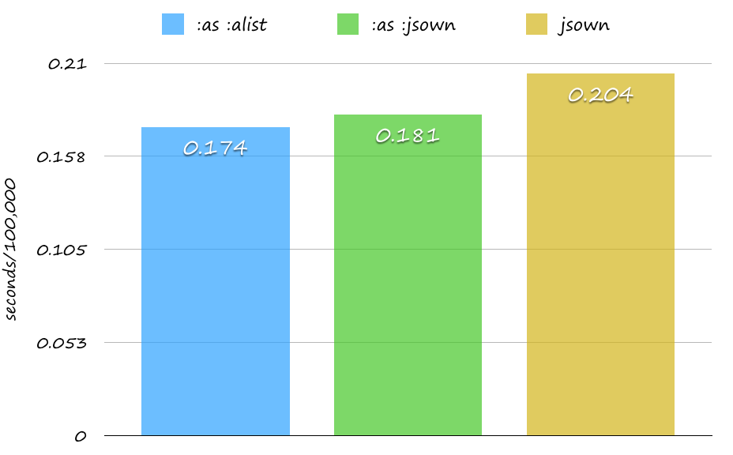

# Jonathan

[](https://circleci.com/gh/Rudolph-Miller/jonathan)
[](https://travis-ci.org/Rudolph-Miller/jonathan)
[](https://coveralls.io/r/Rudolph-Miller/jonathan?branch=master)
[](http://quickdocs.org/jonathan/)

JSON encoder and decoder.  
It's faster than [jsown](https://github.com/madnificent/jsown) - high performance Common Lisp json parser.

See [Document](http://rudolph-miller.github.io/jonathan/overview.html).  
This HTML is generated by [Codex](https://github.com/CommonDoc/codex).

## Usage

```Lisp
(to-json '(:name "Common Lisp" :born 1984 :impls (SBCL KCL)))
;; => "{\"NAME\":\"Common Lisp\",\"BORN\":1984,\"IMPLS\":[\"SBCL\",\"KCL\"]}"

(to-json '(:name "Common Lisp" :born 1984 :impls (SBCL KCL))
         :octets t)
;; => #(123 34 78 65 77 69 34 58 34 67 111 109 109 111 110 32 76 ...)

(to-json '((:name . "Common Lisp") (:born . 1984) (:impls SBCL KCL))
         :from :alist)
;; => "{\"NAME\":\"Common Lisp\",\"BORN\":1984,\"IMPLS\":[\"SBCL\",\"KCL\"]}"

(to-json '(:obj (:name . "Common Lisp") (:born . 1984) (:impls SBCL KCL))
         :from :jsown)
;; => "{\"NAME\":\"Common Lisp\",\"BORN\":1984,\"IMPLS\":[\"SBCL\",\"KCL\"]}"

(let ((encoder (compile-encoder (:from :alist) (name)
                 `(("name" . ,name)))))
  (funcall encoder "Rudolph"))
;; => "{\"name\":\"Rudolph\"}"

(parse "{\"NAME\":\"Common Lisp\",\"BORN\":1984,\"IMPLS\":[\"SBCL\",\"KCL\"]}")
;; => (:NAME "Common Lisp" :BORN 1984 :IMPLS ("SBCL" "CCL" "KCL"))

(parse "{\"NAME\":\"Common Lisp\",\"BORN\":1984,\"IMPLS\":[\"SBCL\",\"KCL\"]}"
       :as :alist)
;; => (("NAME" . "Common Lisp") ("BORN" . 1984) ("IMPLS" "SBCL" "CCL" "KCL"))

(parse "{\"NAME\":\"Common Lisp\",\"BORN\":1984,\"IMPLS\":[\"SBCL\",\"KCL\"]}"
       :as :jsown)
;; => (:obj ("NAME" . "Common Lisp") ("BORN" . 1984) ("IMPLS" "SBCL" "CCL" "KCL"))

(parse "{\"NAME\":\"Common Lisp\",\"BORN\":1984,\"IMPLS\":[\"SBCL\",\"KCL\"]}"
       :as :hash-table)
;; => #<HASH-TABLE :TEST EQUAL :COUNT 3>
```

## Installasion

```Lisp
(ql:quickload :jonathan)
```

## to-json
- can encode Object into JSON format.
  - Restricted Property List. (`:from :plist`)
  - Association List. (`:from :alist`)
  - Jsown Object. (`:from :jsown`)
- can return not only string but also octets.
- can be compiled by compiler-macro.

```Lisp
;; Restricted Property List Samples
(to-json '(:name :age :born :impls))
;; => "{\"NAME\":\"AGE\",\"BORN\":\"IMPLS\"}"
;; not "[\"NAME\",\"AGE\",\"BORN\",\"IMPLS\"]"

(to-json '(:name "Common Lisp" :born))
;; => "{\"NAME\":\"Common Lisp\",\"BORN\":[]}"
```

- is customizable by `%to-json`, `%write-char` and `%write-string`.

```Lisp
(defclass user ()
  ((id :type integer :initarg :id)
   (name :type string :initarg :name)))

(defmethod %to-json ((user user))
  (with-object
    (write-key-value "id" (slot-value user 'id))
    (write-key-value "name" (slot-value user 'name))))

(to-json (make-instance 'user :id 1 :name "Rudolph"))
;; => "{\"id\":1,\"name\":\"Rudolph\"}"
```


```Lisp
(let ((post (compile-encoder () (text)
               (list :|channel| "lisp-alien"
                     :|username| "alien-bot"
                     :|text| text
                     :|icon_url| "http://www.lisperati.com/lisplogo_warning2_256.png"))))
  (time
   (dotimes (_ 100000)
     (funcall post "Post from Alien!"))))
;; => 0.095

(flet ((post (text)
         (jonathan:to-json
               (list :|channel| "lisp-alien"
                     :|username| "alien-bot"
                     :|text| text
                     :|icon_url| "http://www.lisperati.com/lisplogo_warning2_256.png"))))
  (time
   (dotimes (_ 100000)
     (post "Post from Alien!"))))
;; => 0.095

(flet ((post (text)
         (format nil "{\"channel\":\"lisp-alien\",\"username\":\"alien-bot\",\"text\":~s,\"icon_url\":\"http://www.lisperati.com/lisplogo_warning2_256.png\"}" text)))
  (time
   (dotimes (_ 100000)
     (post "Post from Alien!"))))"\"}"))))
;; => 0.146

(flet ((post (text)
         (jonathan:to-json
               (list :|channel| "lisp-alien"
                     :|username| "alien-bot"
                     :|text| text
                     :|icon_url| "http://www.lisperati.com/lisplogo_warning2_256.png"))))
  (time
   (dotimes (_ 100000)
     (post "Post from Alien!"))))
;; => 0.604 - without compiler-macro.

(flet ((post (text)
         (jsown:to-json
          `(:obj (:|channel| . "lisp-alien")
                 (:|username| . "alien-bot")
                 (:|text| . ,text)
                 (:|icon_url| . "http://www.lisperati.com/lisplogo_warning2_256.png")))))
  (time
   (dotimes (_ 100000)
     (post "Post from Alien!"))))
;; => 1.117
```

## parse
- can decode JSON format string into Object.
  - Property List. (`:as :plist`)
  - Association List. (`:as :alist`)
  - Json Object. (`:as :jsown`)
  - Hash Table. (`:as :hash-table`)
- can allow junked JSON format string (`:junk-allowed t`)
- can customize `*null-value*`, `*false-value*` and `*empty-array-value*`.
- can restrict keywords to read. (`:keywords-to-read`)
- can normalize keywords. (`:keyword-normalizer`)
  - can not normalize keywords in nested objects.
  - can ignore keywords when normalizer returns NIL.
- can unescape unicode escape sequences. (`:unescape-unicode-escape-sequence`)

```Lisp
(parse "{\"key\":\"value\"}")
;; => (:|key| "value")

(parse "{\"key\":\"value\"")
;; => raise <jonathan-unexpected-eof>.

(parse "{\"key\":\"value\"" :junk-allowed t)
;; => (:|key| "value")

(let ((*null-value* :null)
      (*false-value* :false)
      (*empty-array-value* :[]))
  (parse "{\"null\":null,\"false\":false,\"empty\":[]}"))
;; => (:|null| :NULL :|false| :FALSE :|empty| :[])

(parse "{\"key1\":\"value1\",\"key2\":\"value2\"}" :keywords-to-read '("key1"))
;; => (:|key1| "value1")

(flet ((normalizer (key)
         (with-vector-parsing (key)
           (match-i-case
             ("key1" (return-from normalizer "other-key1"))
             ("key2" (return-from normalizer "other-key2"))
             (otherwise (return-from normalizer nil))))))
  (parse "{\"KEY1\":{\"key2\":\"value2\"},\"key3\":\"value3\"}"
         :keyword-normalizer #'normalizer)
;; => (:|other-key1| (:|key2| "value2"))
  (parse "{\"KEY1\":{\"key2\":\"value2\"},\"key3\":\"value3\"}"
         :keyword-normalizer #'normalizer
         :normalize-all t))
;; => (:|other-key1| (:|other-key2| "value2"))

(parse "\"\\u30b8\\u30e7\\u30ca\\u30b5\\u30f3\"")
;; => "ジョナサン"

(parse "\"\\uD840\\uDC0B\"")
;; => "𠀋"

(parse "\"\\u30b8\\u30e7\\u30ca\\u30b5\\u30f3\""
       :unescape-unicode-escape-sequence nil)
;; => "\u30b8\u30e7\u30ca\u30b5\u30f3"
```



```Lisp
(let ((s "{\"key1\":\"value\",\"key2\":1.1,\"key3\":[\"Hello\",1.2]}"))
  (time
   (dotimes (_ 100000)
     (jonathan:parse s :as :alist))))
;; => 0.174

(let ((s "{\"key1\":\"value\",\"key2\":1.1,\"key3\":[\"Hello\",1.2]}"))
  (time
   (dotimes (_ 100000)
     (jonathan:parse s :as :jsown))))
;; => 0.181

(let ((s "{\"key1\":\"value\",\"key2\":1.1,\"key3\":[\"Hello\",1.2]}"))
  (time
   (dotimes (_ 100000)
     (jsown:parse s))))
;; => 0.204
```


```Lisp
(let ((s "{\"key1\":\"value\",\"key2\":1.1,\"key3\":[\"Hello\",1.2]}"))
  (time
   (dotimes (_ 100000)
     (jonathan:parse s :as :alist :keywords-to-read '("key1")))))
;; => 0.065

(let ((s "{\"key1\":\"value\",\"key2\":1.1,\"key3\":[\"Hello\",1.2]}"))
  (time
   (dotimes (_ 100000)
     (jonathan:parse s :as :jsown :keywords-to-read '("key1")))))
;; => 0.069

(let ((s "{\"key1\":\"value\",\"key2\":1.1,\"key3\":[\"Hello\",1.2]}"))
  (time
   (dotimes (_ 100000)
     (jsown:parse s "key1"))))
;; => 0.085
```

## Helper

### compile-encoder

- can compile encoder.

```Lisp
(compile-encoder () (name)
  (list :name name))
;; => #<FUNCTION (LAMBDA (name))>

(funcall * "Rudolph")
;; => "{\"NAME\":\"Rudolph\"}"

(compile-encoder (:from :alist) (name)
  `(("name" . ,name)))
;; => #<FUNCTION (LAMBDA (name))>

(funcall * "Rudolph")
;; => "{\"name\":\"Rudolph\"}"

(compile-encoder (:octets t) (name)
  (list :name name))
;; => #<FUNCTION (LAMBDA (name))>

(funcall * "Rudolph")
;; => #(123 34 75 69 89 49 ...)
```

### with-object

```Lisp
(defclass user ()
  ((id :initarg :id)
   (name :initarg :name)))
   
(defmethod %to-json ((user user))
  (with-object
    (write-key "id")
    (write-value (slot-value user 'id))
    (write-key-value "name" (slot-value user 'name))))

(to-json (make-instance 'user :id 1 :name "Rudolph"))
;; => "{\"id\":1,\"name\":\"Rudolph\"}"
```

### with-array

```Lisp
(defclass user ()
  ((id :initarg :id)
   (name :initarg :name)))
   
(defmethod %to-json ((user user))
  (with-array
    (write-item "id")
    (write-item (slot-value user 'id))
    (write-item "name")
    (write-item (slot-value user 'name))))

(to-json (make-instance 'user :id 1 :name "Rudolph"))
;; => "[\"id\",1,\"name\",\"Rudolph\"]"
```

### with-output

```Lisp
(with-output-to-string (stream)
  (with-output (stream)
    (with-object
      (write-key-value "key" "value"))))
;; => "{\"key\":\"value\"}"
```

### with-output-to-string*

```Lisp
(with-output-to-string*
  (with-object
    (write-key-value "key" "value"))))
;; => "{\"key\":\"value\"}"
```

## See Also
- [proc-parse](https://github.com/fukamachi/proc-parse)

## Author

- Rudolph-Miller

## Copyright

Copyright (c) 2015 Rudolph-Miller
