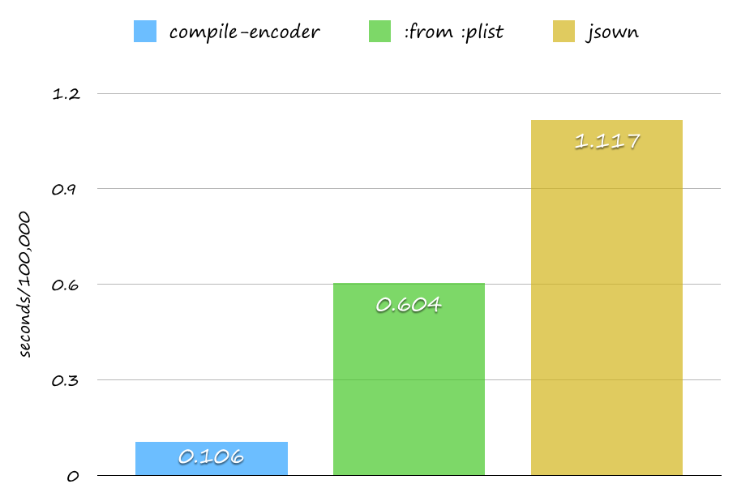
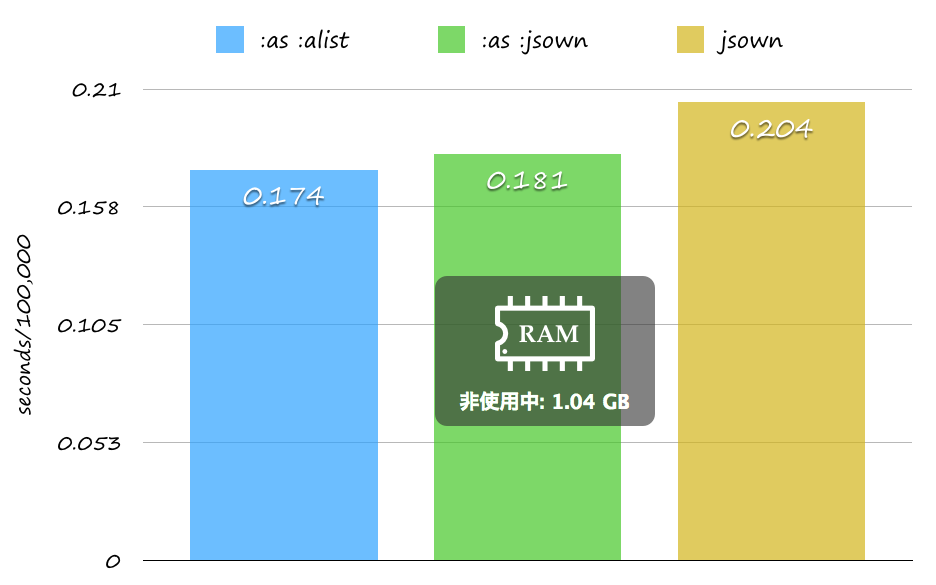

# Jonathan

[](https://travis-ci.org/Rudolph-Miller/jonathan)

JSON encoder and decoder.  
It's faster than [jsown](https://github.com/madnificent/jsown) - high performance Common Lisp json parser.

## Usage

```Lisp
(to-json '(:name "Common Lisp" :born 1984 :impls (SBCL KCL)))
;; => "{\"NAME\":\"Common Lisp\",\"BORN\":1984,\"IMPLS\":[\"SBCL\",\"KCL\"]}"

(to-json '(:name "Common Lisp" :born 1984 :impls (SBCL KCL))
         :octet t)
;; => #(123 34 78 65 77 69 34 58 34 67 111 109 109 111 110 32 76 ...)

(to-json '((:name . "Common Lisp") (:born . 1984) (:impls SBCL KCL))
         :from :alist)
;; => "{\"NAME\":\"Common Lisp\",\"BORN\":1984,\"IMPLS\":[\"SBCL\",\"KCL\"]}"

(to-json '(:obj (:name . "Common Lisp") (:born . 1984) (:impls SBCL KCL))
         :from :jsown)
;; => "{\"NAME\":\"Common Lisp\",\"BORN\":1984,\"IMPLS\":[\"SBCL\",\"KCL\"]}"

(let ((encoder (compile-encoder (:from :alist) (name)
                 `(("name" . ,name)))))
  (funcall encoder "Rudolph"))
;; => "{\"name\":\"Rudolph\"}"

(parse "{\"NAME\":\"Common Lisp\",\"BORN\":1984,\"IMPLS\":[\"SBCL\",\"KCL\"]}")
;; => (:NAME "Common Lisp" :BORN 1984 :IMPLS ("SBCL" "CCL" "KCL"))

(parse "{\"NAME\":\"Common Lisp\",\"BORN\":1984,\"IMPLS\":[\"SBCL\",\"KCL\"]}"
       :as :alist)
;; => (("NAME" . "Common Lisp") ("BORN" . 1984) ("IMPLS" "SBCL" "CCL" "KCL"))

(parse "{\"NAME\":\"Common Lisp\",\"BORN\":1984,\"IMPLS\":[\"SBCL\",\"KCL\"]}"
       :as :jsown)
;; => (:obj ("NAME" . "Common Lisp") ("BORN" . 1984) ("IMPLS" "SBCL" "CCL" "KCL"))
```

## to-json
- can encode Object into JSON format.
  - Rstricted Property List. (`:from :plist`)
  - Association List. (`:from :alist`)
  - Jsown Object. (`:from :jsown`)
- can return not only string but also octets.

```Lisp
;; Restricted Property List Samples
(to-json '(:name :age :born :impls))
;; => "{\"NAME\":\"AGE\",\"BORN\":\"IMPLS\"}"
;; not "[\"NAME\",\"AGE\",\"BORN\",\"IMPLS\"]"

(to-json '(:name "Common Lisp" :born))
;; => "{\"NAME\":\"Common Lisp\",\"BORN\":[]}"
```

- is customizable by `%to-json`, `%write-char` and `%write-string`.

```Lisp
(defclass user ()
  ((id :type integer :initarg :id)
   (name :type string :initarg :name)))

(defmethod %to-json ((user user))
  (with-object
    (write-key-value "id" (slot-value user 'id))
    (write-key-value "name" (slot-value user 'name))))

(to-json (make-instance 'user :id 1 :name "Rudolph"))
;; => "{\"id\":1,\"name\":\"Rudolph\"}"
```



```Lisp
(let ((data '(:hello :world)))
  (time
   (dotimes (_ 100000)
     (jonathan:to-json data :from :plist))))
;; => 0.126

(let ((data '(:obj ("HELLO" . "WORLD"))))
  (time
   (dotimes (_ 100000)
     (jonathan:to-json data :from :jsown))))
;; => 0.119

(let ((data '(:obj ("HELLO" . "WORLD"))))
  (time
   (dotimes (_ 100000)
     (jonathan:to-json data :octets t))))
;; => 0.120

(let ((data '(:obj ("HELLO" . "WORLD"))))
  (time
   (dotimes (_ 100000)
     (jsown:to-json data))))
;; => 0.26
```

## parse
- can decode JSON format string into Object.
  - Property List. (`:as :plist`)
  - Association List. (`:as :alist`)
  - Json Object. (`:as :jsown`)
- can allow junked JSON format string (`:junk-allowed t`)

```Lisp
(parse "{\"key\":\"value\"}")
;; => (:|key| "value")

(parse "{\"key\":\"value\"")
;; => raise <jonathan-unexpected-eof>.

(parse "{\"key\":\"value\"" :junk-allowed t)
;; => (:|key| "value")
```



```Lisp
(let ((s "{\"key1\":\"value\",\"key2\":1.1,\"key3\":[\"Hello\",1.2]}"))
  (time
   (dotimes (_ 100000)
     (jonathan:parse s :as :plist))))
;; => 0.266

(let ((s "{\"key1\":\"value\",\"key2\":1.1,\"key3\":[\"Hello\",1.2]}"))
  (time
   (dotimes (_ 100000)
     (jonathan:parse s :as :alist))))
;; => 0.174

(let ((s "{\"key1\":\"value\",\"key2\":1.1,\"key3\":[\"Hello\",1.2]}"))
  (time
   (dotimes (_ 100000)
     (jonathan:parse s :as :jsown))))
;; => 0.181

(let ((s "{\"key1\":\"value\",\"key2\":1.1,\"key3\":[\"Hello\",1.2]}"))
  (time
   (dotimes (_ 100000)
     (jsown:parse s))))
;; => 0.204
```

## Helper

### compile-encoder

- can compile encoder.

```Lisp
(compile-encoder () (name)
  (list :name name))
;; => #<FUNCTION (LAMBDA (name))>

(funcall * "Rudolph")
;; => "{\"NAME\":\"Rudolph\"}"

(compile-encoder (:from :alist) (name)
  `(("name" . ,name)))
;; => #<FUNCTION (LAMBDA (name))>

(funcall * "Rudolph")
;; => "{\"name\":\"Rudolph\"}"

(compile-encoder (:octet t) (name)
  (list :name name))
;; => #<FUNCTION (LAMBDA (name))>

(funcall * "Rudolph")
;; => #(123 34 75 69 89 49 ...)
```

### with-object

```Lisp
(defclass user ()
  ((id :initarg :id)
   (name :initarg :name)))
   
(defmethod %to-json ((user user))
  (with-object
    (write-key "id")
    (write-value (slot-value user 'id))
    (write-key-value "name" (slot-value user 'name))))

(to-json (make-instance 'user :id 1 :name "Rudolph"))
;; => "{\"id\":1,\"name\":\"Rudolph\"}"
```

### with-array

```Lisp
(defclass user ()
  ((id :initarg :id)
   (name :initarg :name)))
   
(defmethod %to-json ((user user))
  (with-array
    (write-item "id")
    (write-item (slot-value user 'id))
    (write-item "name")
    (write-item (slot-value user 'name))))

(to-json (make-instance 'user :id 1 :name "Rudolph"))
;; => "[\"id\",1,\"name\",\"Rudolph\"]"
```

### with-output

```Lisp
(with-output-to-string (stream)
  (with-output (stream)
    (with-object
      (write-key-value "key" "value"))))
;; => "{\"key\":\"value\"}"
```

### with-output-to-string*

```Lisp
(with-output-to-string*
  (with-object
    (write-key-value "key" "value"))))
;; => "{\"key\":\"value\"}"
```

## See Also
- [proc-parse](https://github.com/fukamachi/proc-parse)

## Author

- Rudolph-Miller

## Copyright

Copyright (c) 2015 Rudolph-Miller
